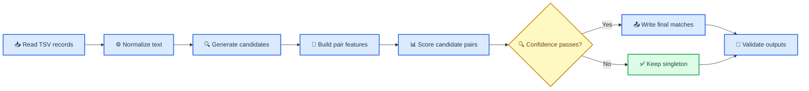

# Amazon ML Challenge 2026: Entity Resolution Preparation Plan

_Working plan based on `Emails Comms_ Amazon ML Challenge 2026.pdf`; dataset is not available yet._

---

## 📋 Executive decision

Build a **two-stage, precision-first entity-resolution pipeline**:

1. Generate a high-recall candidate set for every `S1-*` record using deterministic name/address blocking and fuzzy retrieval.
2. Score every candidate pair with a calibrated pair classifier, then choose a conservative set of matches per `S1` entity.

The first submission should be generated before model experimentation: a valid, conservative exact-match baseline protects the team from spending the whole window without a scoreable artifact.

The task is **business entity resolution**, not product pricing. The older Amazon ML Challenge 2025 PDFs in `Downloads` are unrelated and should not drive this solution.

## 🎯 What the brief fixes

- Sources: `S1`, `S2`, `S3`; only `S1` entities need output rows.
- Fields: `entity_id`, `business_name`, `business_address`, `country`.
- Training countries: US and India; test introduces France.
- Labels: each `S1` maps to zero, one, or many `S2`/`S3` IDs.
- Score: macro-average per-`S1` F-beta with beta `0.5`; false matches are more costly than missed matches.
- Singletons are scored: predicting empty for a true singleton gives `1.0`; predicting any match gives `0.0`.
- Candidate pairs are audited and must be the exact final candidate set scored by the model.
- Every test `S1` must appear exactly once in both output files.
- No external business databases, APIs, geocoding services, or internet-derived augmentation.
- Reproducible package: code, pinned environment, README, methodology, and both output TSVs.

## ⚠️ One ambiguity to resolve immediately

The PDF extraction uses singular column names in one table (`matched_entity_id`, `candidate_entity_id`) but plural names in the examples and surrounding text (`matched_entity_ids`, `candidate_entity_ids`). Do not guess the header.

When the dataset arrives, inspect the provided sample output and `utils/validate_submission.py` first. The validator and sample are authoritative. Until then, keep the writer configurable and do not package a hard-coded header.

## 🧭 Recommended architecture



### Module layout

```text
code/business_entity_resolution/
├── src/
│   ├── cli.py
│   ├── io.py
│   ├── normalize.py
│   ├── blocking.py
│   ├── features.py
│   ├── model.py
│   ├── decision.py
│   ├── metrics.py
│   └── validate.py
├── tests/
├── README.md
└── requirements.txt
output/
├── matching_results.tsv
└── candidate_pairs.tsv
Documentation_template.md
```

Keep normalization, blocking, feature extraction, model scoring, and entity-level selection as separate modules. The model receives a fixed candidate-pair table and never silently generates extra candidates.

## 🔍 Candidate generation

Candidate generation is the recall ceiling. Use a **union of cheap keys**, not one brittle similarity threshold.

### Blocking keys

Apply each key to normalized name/address fields and union the resulting candidate IDs:

1. Exact normalized full name.
2. Sorted name tokens.
3. Name prefix and rare name tokens.
4. Character n-gram keys from the name (3-gram or 4-gram).
5. Exact normalized address.
6. House/building number plus postal/PIN code, when present.
7. House/building number plus street token.
8. Address character n-grams.
9. Rare address or landmark tokens.

Use a per-`S1` cap only after measuring recall. A reasonable starting experiment is 100, 250, and 500 candidates per source, but the data must choose the operating point.

### Country handling

- Never hard-code `{US, India, France}` or filter out unknown labels.
- Use country equality/mismatch and normalized country strings as generic features.
- Country-aware blocking is useful, but retain a fallback for missing or inconsistent country values.
- Do not learn a one-hot country identity that assigns an unseen country a misleading “unknown” embedding. France must be handled using text/address evidence and the same generic decision rule.

### Blocking diagnostics

For every validation fold, report:

- True-edge recall overall and by source (`S2`, `S3`).
- Recall by country and by true match cardinality (`0`, `1`, `2+`).
- Candidate pairs per `S1`, total pairs, and reduction ratio versus the Cartesian product.
- Fraction of `S1` entities with zero candidates.
- Candidate generation time and peak memory.

Do not proceed to expensive modeling until candidate recall is understood. A model cannot recover a true match that blocking removed.

## 🧠 Pair model and features

### Baseline model

Start with a fast pair classifier such as LightGBM/XGBoost if available, otherwise logistic regression on handcrafted features. Establish an OOF baseline before trying embeddings or an encoder model.

The training target for a candidate pair is:

```text
label = 1 if candidate_id is in the ground-truth list for that S1
label = 0 otherwise
```

All non-matching candidates are valid negatives. Do not generate random negatives before measuring the hard candidates; random negatives make the task look easier than it is.

### Feature groups

**Name**

- Normalized exact equality
- Token Jaccard, Dice, and overlap coefficient
- Character n-gram Jaccard/cosine
- Edit similarity and longest common substring
- Token-sort and prefix/suffix similarity
- Length ratio and token-count difference
- Shared legal suffix/abbreviation indicator

**Address**

- Same similarity family as name
- House/building number equality
- Postal/PIN equality or conflict
- Numeric-token overlap
- Street/city/landmark token overlap
- Address length and missingness
- Exact normalized address equality

**Cross-field and pair context**

- Name tokens appearing in address and vice versa
- Country equality, mismatch, and missingness
- Source indicator (`S2` versus `S3`)
- Field-length ratios and missing-field flags
- Best rank within the `S1` candidate list
- Score gap to the next candidate
- Candidate-list size
- Source-specific rank and score gap

Compute rank and gap features from the candidate table itself, without using labels. Legal-suffix and street-abbreviation dictionaries may be encoded from the challenge description and observed training data; do not fetch external business or address databases.

### Hard-negative mining

1. Train on all feasible candidate negatives or a controlled hard-negative sample.
2. Rank validation negatives by model score.
3. Add the highest-scoring false positives to the next training round.
4. Repeat only while validation F0.5 improves.

Keep an untouched threshold-tuning split or use nested out-of-fold predictions. Otherwise hard-negative selection can overfit the validation set.

## 🎯 Entity-level decisions

The model produces a score for each `(S1, candidate)` pair, but the competition scores a set for each `S1`.

### Do not force one-to-one matching

The brief explicitly allows one `S1` to match many records. Do not use a global Hungarian assignment or assume each `S2`/`S3` record can belong to only one `S1` unless the training data proves that constraint. Score each `S1` independently first.

### Threshold policy

Tune the final decision directly on the competition metric:

- Sweep a global probability threshold.
- Tune separate thresholds for `S2` and `S3` if validation supports it.
- Sweep a maximum match count such as `1`, `2`, `3`, `5`, `10`, and unlimited.
- Select matches where `score >= threshold`, then cap the list if the cap improves validation F0.5.
- If no candidate passes, output an empty list.

Do not use `0.5` by default. F0.5 is precision-heavy, and singleton false positives receive a full entity-level zero, so the optimal operating point may be substantially more conservative.

Consider a relative rule only as an ablation: accept a candidate above an absolute threshold only when its score is sufficiently above the next candidate. Absolute thresholds are easier to audit and usually safer under distribution shift.

## 📊 Exact local metric

Implement the scorer independently of model training and test it with hand-calculated examples.

For one `S1` entity:

```python
def entity_f05(predicted, truth):
    predicted = set(predicted)
    truth = set(truth)

    if not truth:
        return 1.0 if not predicted else 0.0
    if not predicted:
        return 0.0

    tp = len(predicted & truth)
    if tp == 0:
        return 0.0

    precision = tp / len(predicted)
    recall = tp / len(truth)
    return (1.25 * precision * recall) / (0.25 * precision + recall)


def macro_f05(rows):
    return sum(entity_f05(pred, truth) for pred, truth in rows) / len(rows)
```

The final score is the mean over all evaluated `S1` entities. Verify the portal implementation when available, especially the singleton convention and whether empty predictions for non-singletons are treated exactly as the brief states.

## 🔄 Leakage-safe validation

Split at the `S1` entity level, never at the pair level. Stratify by country and true match cardinality where counts permit. Prefer grouped splitting by normalized name/address or an approximate connected component so near-duplicate `S1` records do not straddle folds.

For each fold:

1. Fit normalization statistics, IDF, and model parameters on the training portion only.
2. Build blocking indices from the available `S2`/`S3` records without using validation labels.
3. Generate candidates for validation `S1` records.
4. Score candidates with the fold model.
5. Tune thresholds using inner/OOF predictions, not predictions from a model fitted on the same rows.
6. Report both conditional pair metrics and end-to-end entity F0.5.

Track:

- Blocking recall ceiling
- Pair PR-AUC and precision at candidate budgets
- Macro F0.5
- Recall and precision by source, country, and cardinality
- False positives on true singletons
- False negatives on multi-match entities
- Score calibration and threshold stability across folds

The safest practical setup is five grouped folds, repeated with two seeds if time permits. Pool OOF predictions for threshold selection, then retrain on all labeled data with the selected operating point.

## ⏱️ 72-hour execution plan

### Hours 0–4: freeze the rules and get a valid artifact

- Inventory all files, row counts, columns, countries, nulls, duplicate IDs, and label cardinality.
- Confirm the exact output headers and run the provided validator on a dummy file.
- Create a minimal repository and environment lock.
- Implement a conservative exact-normalized-name-plus-address baseline.
- Generate `matching_results.tsv` and `candidate_pairs.tsv` for every test `S1`.
- Keep an all-empty fallback submission.

**Exit criterion:** a valid end-to-end submission exists, even if its score is weak.

### Hours 4–12: maximize blocking recall

- Implement name/address normalization.
- Add exact and token-based inverted indexes.
- Add character n-gram and fuzzy retrieval.
- Measure recall at multiple candidate caps.
- Inspect missed true pairs by country and source.
- Select the smallest candidate budget that preserves the required recall margin.

**Exit criterion:** blocking diagnostics are reproducible and a high-recall candidate set is selected.

### Hours 12–22: first learned baseline

- Build pair features.
- Train a fast classifier with hard negatives.
- Create OOF predictions and the exact macro F0.5 scorer.
- Sweep global and source-specific thresholds.
- Produce the first serious leaderboard submission.
- Save the run configuration and score report.

**Exit criterion:** an OOF-validated model beats the conservative baseline end to end.

### Hours 22–34: error analysis and hard negatives

- Manually inspect only aggregate-safe error slices and a small controlled sample.
- Separate failures caused by blocking, normalization, missing fields, country shift, and model confusion.
- Add targeted normalization or features.
- Perform one or two hard-negative rounds.
- Re-evaluate threshold stability across folds.

**Exit criterion:** each remaining error class has a measured size and an owner.

### Hours 34–46: stronger model

- Compare LightGBM/XGBoost/logistic regression variants.
- Add TF-IDF/character similarity features if they help OOF.
- Test source-specific calibration and match-count caps.
- Consider an open-license encoder or language model only after checking the competition’s exact model/data rule; classical features remain the fallback.

**Exit criterion:** choose one model based on OOF F0.5, not leaderboard cherry-picking.

### Hours 46–56: France and robustness

- Verify every test `S1` is represented, including France.
- Test missing country, missing address, transliteration, punctuation, abbreviation, and word-order perturbations.
- Check behavior when one source has no plausible candidates.
- Make the pipeline deterministic and rerunnable from the package.

**Exit criterion:** no known distribution-shift or formatting failure remains.

### Hours 56–64: final inference and audit

- Retrain on all labeled data.
- Generate candidates using the exact final blocking code.
- Score exactly those candidates.
- Write both TSVs with the confirmed headers.
- Verify final matches are a subset of candidates.
- Run the provided validator and independent checks.

**Exit criterion:** output files pass every available validator.

### Hours 64–72: package and buffer

- Fill the methodology template.
- Pin dependencies and document exact commands.
- Run the pipeline from a clean environment or a fresh process.
- Package the required zip structure.
- Upload only after checking file hashes and row counts.
- Keep at least one safe submission and one improved submission ready.

**Exit criterion:** a teammate can reproduce both output files without hidden state.

## 👥 Suggested team split for 3–4 people

| Owner | Primary responsibility | Required handoff |
|---|---|---|
| Data/blocking lead | Schema audit, normalization, candidate generation, recall | Candidate table and blocking report |
| Model lead | Pair features, classifier, OOF predictions, hard negatives | Model artifact and OOF score report |
| Validation/infra lead | Splits, metric, threshold sweeps, output validator | Reproducible run and validated TSVs |
| Optional fourth owner | Advanced features/model and error analysis | Only changes that improve OOF F0.5 |

If the team is smaller, merge validation/infra into the model role, but keep one person solely responsible for final format and reproducibility.

## 🧪 Minimum test checklist

- TSV reader uses an explicit tab separator.
- Empty fields and comma-containing address values survive parsing.
- IDs and output lists are deduplicated deterministically.
- Every test `S1` appears exactly once.
- Every referenced ID exists in the test `S2`/`S3` files.
- Every final match appears in that `S1`’s candidate list.
- Singleton scorer returns `1.0` for empty/empty and `0.0` for any false match.
- A zero/zero division case never crashes the scorer.
- France and unknown country labels are retained.
- A record with missing name/address does not crash blocking.
- A candidate list with no matches writes an empty second field.
- The output headers match the sample and validator exactly.
- A clean rerun produces byte-identical output or documented deterministic differences.

## 🚫 Do not do these

- Do not use external business registries, commercial ER APIs, geocoding, or web-derived data.
- Do not filter the test set to training countries.
- Do not use a one-hot encoding whose unseen France category is silently treated as a normal country.
- Do not randomly split candidate pairs; that leaks `S1`-specific information.
- Do not force one-to-one matching without evidence.
- Do not predict a match for every non-singleton-looking record.
- Do not use random easy negatives instead of measuring hard candidates.
- Do not choose thresholds on the public leaderboard repeatedly.
- Do not call an output valid until the provided validator passes.
- Do not include candidates in `candidate_pairs.tsv` that the final model never actually scored.

## ✅ Immediate next action when data arrives

Run one audit script before writing model code. It should print only aggregate diagnostics:

1. Row counts and unique-ID counts per source.
2. Country counts for train and test.
3. Missingness by field.
4. Ground-truth match-count distribution.
5. Number of positive pairs by source.
6. Number of duplicate normalized names/addresses.
7. Candidate recall for exact and fuzzy blocking.
8. A dummy output that passes the provided validator.

That audit determines whether the next bottleneck is blocking, normalization, or classification. Guessing before seeing those numbers is how teams waste the 72-hour window.
